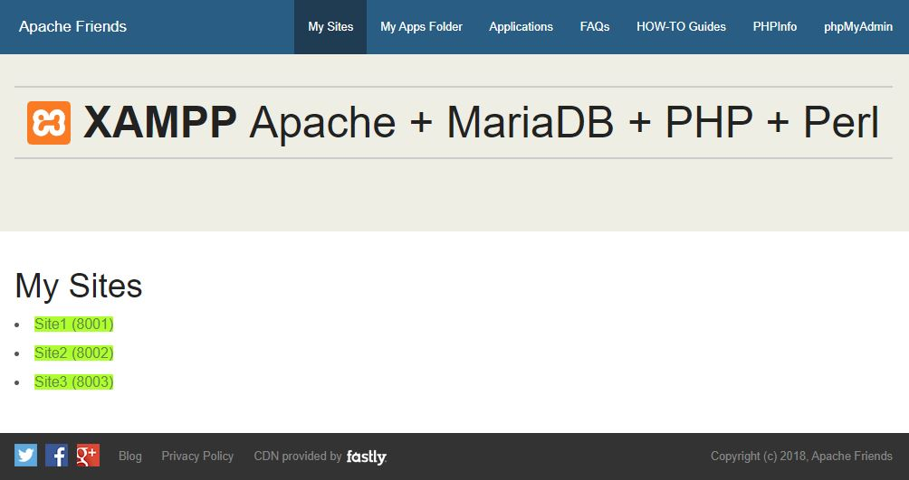
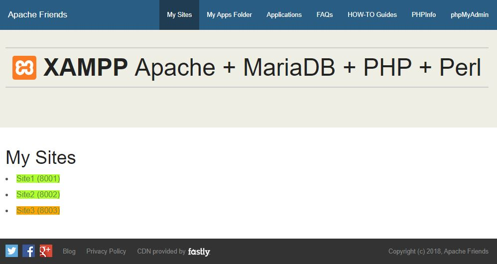

# XAMPP VIRTUALHOST

This is a little project to improve a local development environment in Windows using xampp.


| Index |
| ----- |
| [How to setup httpd-vhosts.conf file](#how-to-setup-httpd-vhostsconf-file) |
| [Automatic configuration](#automatic-configuration) |
| [Manual configuration](#manual-configuration) |
| [Result](#result) |


## How to setup httpd-vhosts.conf file

The main idea is to do a fresh install of xampp and avoid to remove `htdocs` folder's content.

I'm going to consider xampp for php 8.1 version, so that my xampp folder will be named `xampp81` and will be placed in `C:/`.

Every new site or application have to be described inside `apache\conf\extra\httpd-vhosts.conf` file as follows:

```
# Site: YOUR SITE
Listen 8000
<VirtualHost *:8000>
       DocumentRoot "C:/xampp81/htdocs/apps/your-site/public"
       ServerName localhost
</VirtualHost>
```

**AVOID TO USE PORT 80.**


## Automatic configuration

WIP. There will be an script to perform the changes.


## Manual configuration

### Custom files

We have to add two files to `htdocs` folder:
- my-sites.php
- vhost_file.php

from this repo.

### Links

Then you have to *add* these two `<li>` tags:

```
    <li class=""><a href="/my-sites.php">My Sites</a></li>
    <li class=""><a href="/apps">My Apps Folder</a></li>
```

after the `Right Nav Section` comment, inside de `<ul>` tag:

```
<!-- Right Nav Section -->
    <ul class="right">
    ...
```

in the following files:
- 404.html
- faq.html
- howto.html
- index.html

into `dashboard` folder.

### Files

You can also add them to your specific language folder, i.e. `es` folder's files:
- faq.html
- howto.html
- index.html


## Result


### `httpd-vhosts.conf`

```
# Site: Site1
Listen 8001
<VirtualHost *:8001>
       DocumentRoot "C:/xampp74/htdocs/apps/site1/public"
       ServerName localhost
</VirtualHost>

# Site: Site2
Listen 8002
<VirtualHost *:8002>
       DocumentRoot "C:/xampp74/htdocs/apps/site2/public"
       ServerName localhost
</VirtualHost>

# Site: Site3
#Listen 8003
#<VirtualHost *:8003>
#       DocumentRoot "C:/xampp74/htdocs/apps/site3/public"
#       ServerName localhost
#</VirtualHost>
```

### `Browser`

### All sites are actives


### There is an inactive site
